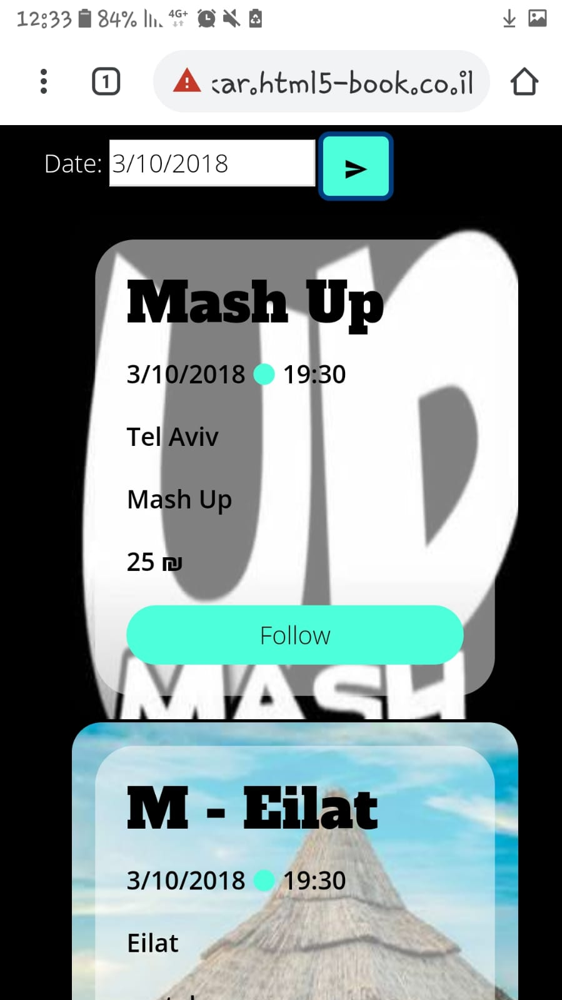

# JeMusic

Welcome to Client-side of JeMusic application!

## Getting Started
### Installing

Clone the application to your directory, 
change directory use CMD : 'cd JeMusic_ClientSide'.
Install the application use CMD: npm install.
Launch the application: 'npm start'

```
git clone https://github.com/ReutLeib/JeMusic_ClientSide.git
cd JeMusic_ClientSide
npm install
npm start
```

## Running the tests

To run the application in Local host you need to go to 'package.json' file 
and remove row 16:
```
"homepage": "http://shenkar.html5-book.co.il/2017-2018/dcs/dev_179/"
```
The application will be available after saving. 

## Screens from JeMusic application
### Login:
;
### Home:
;
;
;
### Profile:
;
### Create Jem:
;
### Search:
;
;
